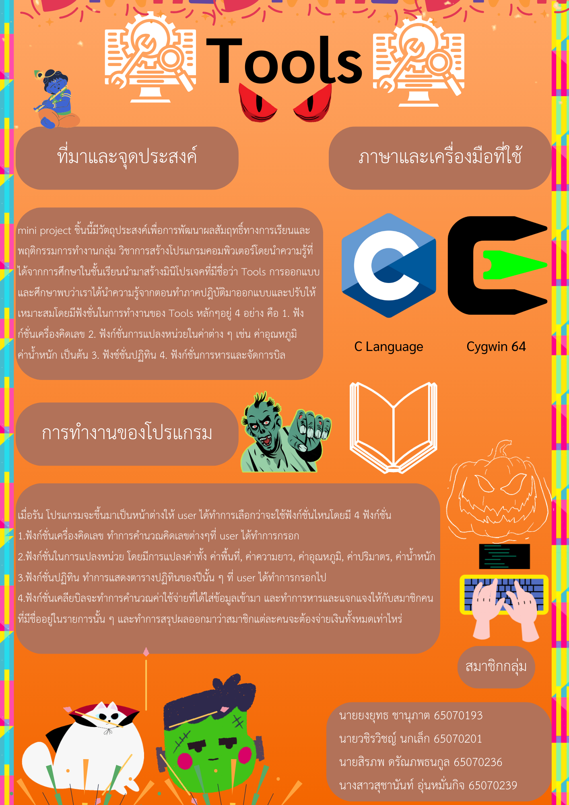

# tools-package-miniProject

## Project poster

## demo VDO

**Link for demo video:**
https://youtu.be/qIoL9ial2hg

## Overview

This is mini-project in Physical Computing Subject.
This Program contains 4 main functions

1. [calculator](##calculator)
2. [unit converter](##unit-converter)
3. [calendar](##calendar)
4. [bill manager](##bill-manager)

### Calculator

Calculator tool contain functions to addition, subtraction, multiplication and division
and also shown the previous result as history log

### Unit converter

Unit converter tool contain main 5 unit converter which is

#### Temperature unit converter

this function contains 3 unit to convert

- Celsuis (C)
- Fahrenheit (F)
- Kelvin (K)

#### Length, Area and Volumn unit converter

these function contains unit symbols from metric systems prefixes and the calculate method depends on which type of converter you use

#### Weight unit converter

### Calendar

Calendar tool contain function to see the calendar of that whole year by only put the year which you want to know.

### Bill Manager

Bill Manager contain function to spread the bill by follow these steps

1. input number of bills
2. input bill's name
3. input total price of the bill
4. input input number of member for the bill
5. input member's name

and the tool will show the total price that each member have to pay
